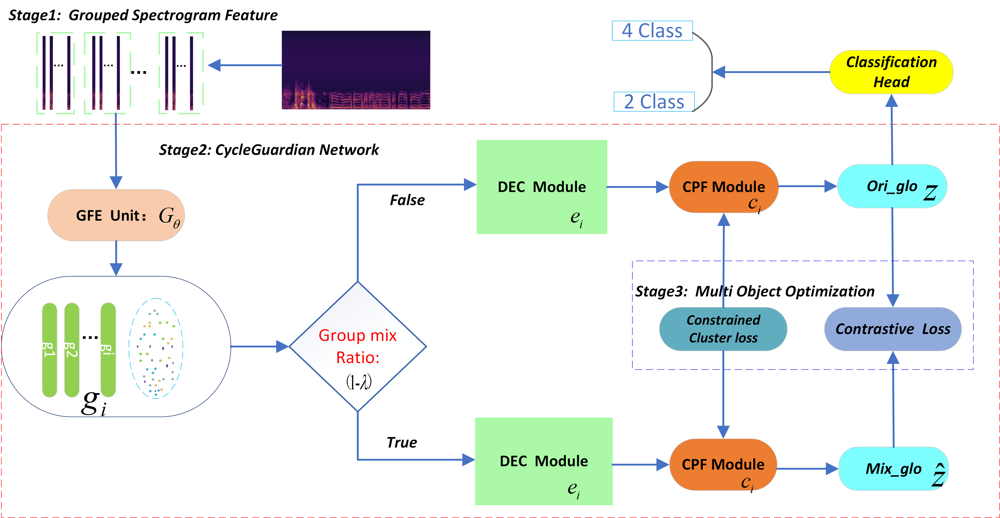
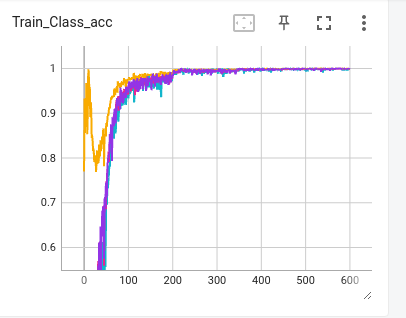
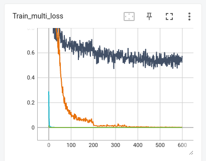
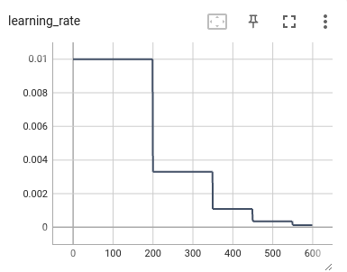

Local changes
# CycleGuardian 
This is the official implementation of the work **[CycleGuardian](https://arxiv.org/abs/2011.00196)**.

# 1.Dependencies:

```
* Python3.8
torch                     1.11.0                   pypi_0    pypi
torchaudio                0.11.0                   pypi_0    pypi
torchlibrosa              0.1.0                    pypi_0    pypi
torchvision               0.12.0                   pypi_0    pypi
* cudnn (CUDA for training on GPU)
```
Dependencies are listed in `cycle_requirements.txt`.
These are all easily installable via, e.g., `pip install numpy` or `conda install`. 
It is recommended to use Anaconda to create a `virtual` environment and setup the dependencies .

# 2.Dataset
* The dataset used is the **[ICBHI Respiratory Challenge 2017 dataset](https://bhichallenge.med.auth.gr/ICBHI_2017_Challenge)**.
* To find out more details about the dataset please visit the official ICBHI Challenge [webpage](https://bhichallenge.med.auth.gr/ICBHI_2017_Challenge).
* Download from above and place the dataset in the `data` folder.

# 3.Train  Script
* We follow both the official `60-40` train-test split as well as the `80-20` split.

## Train Command:

Change the num_worker to suit your machine; also, you may change the batch size, 
but it will affect the final score.

`python  train_lab8_6_3CycleGuardian_specAug.py    --data_dir ./data/ICBHI_final_database --dataset_split_file ./data/patient_trainTest6_4.txt --model_path ./models_out --lr_h 0.001 --lr_l 0.001 --batch_size 128 --num_worker 15 --start_epochs 0 --epochs 600`


# 4. CycleGuardian Overview

<p align='center'>
      
</p>

# 5.Quantitative Results

## Performance of the proposed model

| Method                        | Architecture/ Pretrained | \( S_p \) | \( S_e \) | Score  | Size    |
|-------------------------------|--------------------------|-----------|-----------|--------|---------|
| **4 Class**                   |                          |           |           |        |         |
| Path-level [^song2023patch]   | CNN6 / IN                | 68.59%    | **48.25%**| 58.42% | **20MB+** |
| RespirNet [^gairola2021respirenet] | Resnet34 / IN         | 72.30%    | 40.10%    | 56.20% | 83MB+   |
| Domain transfor [^wang2022domain] | Resnet-st / IN       | 70.40%    | 40.20%    | 55.30% | 50MB+   |
| Late fusion [^pham2022ensemble] | Ince-v3+VGG14 / IN    | **85.60%**| 30.00%    | 57.30% | 610MB+  |
| Co-tuing [^nguyen2022lung]    | Resnet50 / IN           | 79.34%    | 37.24%    | 58.29% | 97MB+   |
| SCL [^moummad2023pretraining] | CNN6 / AS               | 76.93%    | 39.15%    | 58.04% | 20MB+   |
| Patch mix [^bae2023patch]     | AST / IN+AS             | **81.66%**| **43.07%**| **62.37%** | **380MB+** |
| OFGST [^wang2024ofgst]        | Swin Transformer / IN   | 71.56%    | 40.53%    | 56.05% | 410MB+  |
| Stethoscope [^kim2024stethoscope] | AST / IN+AS         | 79.87%    | **43.55%**| 61.71% | 380MB+  |
| RepAug [^kim2024repaugment]   | AST / IN+AS             | **82.47%**| 40.55%    | 61.51% | 380MB+  |
| Lungbrn [^ma2019lungbrn]      | bi-Resent / -           | 69.20%    | 31.12%    | 50.16% | 80MB+   |
| SE+SA [^yang2020adventitious] | Resnet18 / -            | **81.25%**| 17.84%    | 49.55% | 44MB+   |
| LungRN+NL [^ma2020lungrn+]    | Resnet-NL / -           | 63.20%    | 41.32%    | 52.26% | 40MB+   |
| Cnn+MOE [^pham2021cnn]        | C-DNN / -               | 72.40%    | 21.50%    | 47.00% | 30MB+   |
| LungAttn [^li2021lungattn]    | ResNet-Atten / -        | 71.44%    | 36.36%    | 53.90% | 60MB+   |
| ARSC-net [^xu2021arsc]        | bi-Resnet-Att / -       | 67.13%    | **46.38%**| **56.76%** | 80MB+   |
| Prototype [^ren2022prototype] | Cnn8-pt / -             | 72.96%    | 27.78%    | 50.37% | 30MB+   |
| Adversarial [^chang2022example] | Cnn8-dilated / -      | 69.92%    | 35.85%    | 52.89% | 30MB+   |
| Patch mix [^bae2023patch]     | ASTransformer / -       | 72.61%    | 30.58%    | 49.60% | **380MB+** |
| **Ours(cos)**                 | CycleGuardian / -       | **88.92%**| 33.33%    | **61.12%** | **27MB** |
| **Ours(soft cos)**            | CycleGuardian / -       | **82.06%**| **44.47%**| **63.26%** | **38MB** |
| **2 Class**                   |                          |           |           |        |         |
| Co-tuing [^nguyen2022lung]    | Resnet50 / IN            | **79.34%**| 50.04%    | 64.74% | 97MB+   |
| Patch mix [^bae2023patch]     | ASTransformer / IN +AS   | **81.66%**| **55.77%**| **68.71%** | 380MB+  |
| Cnn+MOE [^pham2021cnn]        | C-DNN / -                | 72.40%    | 37.50%    | 54.10% | 30MB+   |
| **Ours**                      | CycleGuardian / -        | 73.19%    | **59.57%**| **66.38%** | **27MB** |
| **Ours(soft cos)**            | CycleGuardian / -        | **71.93%**| **62.77%**| **67.35%** | **38MB** |


###  one of the  tensorboard   training process

### train acc 

<p align='center'>
      
</p>

### train loss and  learning rate
train loss

<p align='center'>
      
</p>


<p align='center'>
      
</p>


### part of   training  results log
```azure


 ==================================================
epoch 599 iter 33/34 Train Total loss: 0.5795828700065613
Train Accuracy: 0.999061473486626
Classwise_Losses Normal: 0.002527494459287292, Crackle: 0.0021995086581145045, Wheeze: 0.005279731647609176, Both: 0.008709785856947726

 -----show the training info -----------
*************The official Metrics******************
The frac format Sp: 0.9995196925552585, Se: 0.998623853073584, Score: 0.9990717728144213
The int  format S_p: 99.95196925552105, S_e: 99.86238530735383, Score: 99.90717728143744
Normal: 0.9995196925552585, Crackle: 0.9991980753007862, Wheeze: 0.9980506820666568, Both: 0.9976190473815194 
 
testing......
Val Accuracy by  fusion result : 0.6181691611555865
epoch 599, Validation BCE loss: 2.727804660797119
Classwise_Losses Normal: 1.5925593402063463, Crackle: 3.354416726221597, Wheeze: 6.381649032856236, Both: 3.004433798120376

 -----show the validation info -----------
*************The official Metrics******************
The frac format Sp: 0.7325361862806796, Se: 0.4766355139444493, Score: 0.6045858501125645
The int  format S_p: 73.25361862806335, S_e: 47.663551394441214, Score: 60.45858501125228
Normal: 0.7325361862806796, Crackle: 0.5457227138643068, Wheeze: 0.27999999993, Both: 0.6310679608587049 
 
*************The Helper Metrics******************
Confusion Matrix 
 [[1164  295   54   76]
 [ 283  370   12   13]
 [ 203   48  112   37]
 [  29   14   33  130]]
Classwise Scores -->:  [0.73253619 0.54572271 0.28       0.63106796]
Accuracy Score ---> : 0.6181691611555865
 Micro F1 Score: 0.6181691611555865
 weighted Precision: 0.6138528596527835
 weighted Recall: 0.6181691611555865
BEST ACCURACY TILL NOW 0.652627915071354
 training process: 100%|███████████████████████████████████████████████████████████████████████████████████████████████████████████████████████████████████████████████| 34/34 [03:41<00:00,  6.50s/it]
best_Se0.44470404977496825      best_Sp0.8206419131529263       best_Sc0.6326729814639473       best_Acc0.652627915071354
ds combine best_Confusion_matrix:
[[0.82064191 0.12083071 0.03398364 0.02454374]
 [0.49115044 0.48082596 0.01917404 0.00884956]
 [0.5825     0.0825     0.3        0.035     ]
 [0.19417476 0.03398058 0.16504854 0.60679612]]
```


# 6. Further reading:
```
@misc{chu2025CycleGuardian,
      title={ycleGuardian: A Framework for Automatic RespiratorySound classification Based on Improved Deep clustering andContrastive Learning}, 
      author={Yun Chu,Qiuhao Wang, Enze Zhou, Ling Fu, Qian Liu, Gang Zheng},
      year={2025},
      eprint={2025.6172348},
      archivePrefix={arXiv},
      primaryClass={cs.AI}
}
```
=======
# CycleGuardian
A  lightwight  Framework  for the  Respiratory Sound  Classification


Auscultation plays a pivotal role in early respiratory and pulmonary disease diagnosis.
Despite the emergence of deep learning-based methods for automatic respiratory
sound classification post-Covid-19, limited datasets impede performance
enhancement. Distinguishing between normal and abnormal respiratory sounds poses
challenges due to the coexistence of normal respiratory components and noise
components in both types. Moreover, different abnormal respiratory sounds exhibit
similar anomalous features, hindering their differentiation. Besides, existing state-of-
the-art models suffer from excessive parameter size, impeding deployment on
resource-constrained mobile platforms.


To address these issues, in this  project, we design a  lightweight network CycleGuardian and propose a framework based on an improved
deep clustering and contrastive learning. We first generate a hybrid spectrogram for
feature diversity and grouping spectrograms to facilitating intermittent abnormal sound
capture.Then, CycleGuardian integrates a deep clustering module with a similarity-
constrained clustering component to improve the ability to capture abnormal features
and a contrastive learning module with group mixing for enhanced abnormal feature
discernment. Multi-objective optimization enhances overall performance during
training. In experiments we use the ICBHI2017 dataset, following the official split
method and without any pre-trained weights, our method achieves Sp: 88.92 $\%$,
Se: 33.33$\%$, and Score: 61.12$\%$ with a network model size of 27M, comparing to
the current model, our method leads by nearly 5$\%$, achieving the current best
performances.Additionally, we deploy the network on Android devices, showcasing a
comprehensive intelligent respiratory sound auscultation system.


# trian 

change the num_worker to  suit your  machine;  also, you may  change the  batch size, but it will  affect the final  score.

```python
python  train_lab8_6_3CycleGuardian_specAug.py    --data_dir ./data/ICBHI_final_database --dataset_split_file ./data/patient_trainTest6_4.txt --model_path ./models_out --lr_h 0.001 --lr_l 0.001 --batch_size 128 --num_worker 15 --start_epochs 0 --epochs 600
```

>>>>>>> 7006db8f21d262c0fc78f1666a05636a57ce1300
